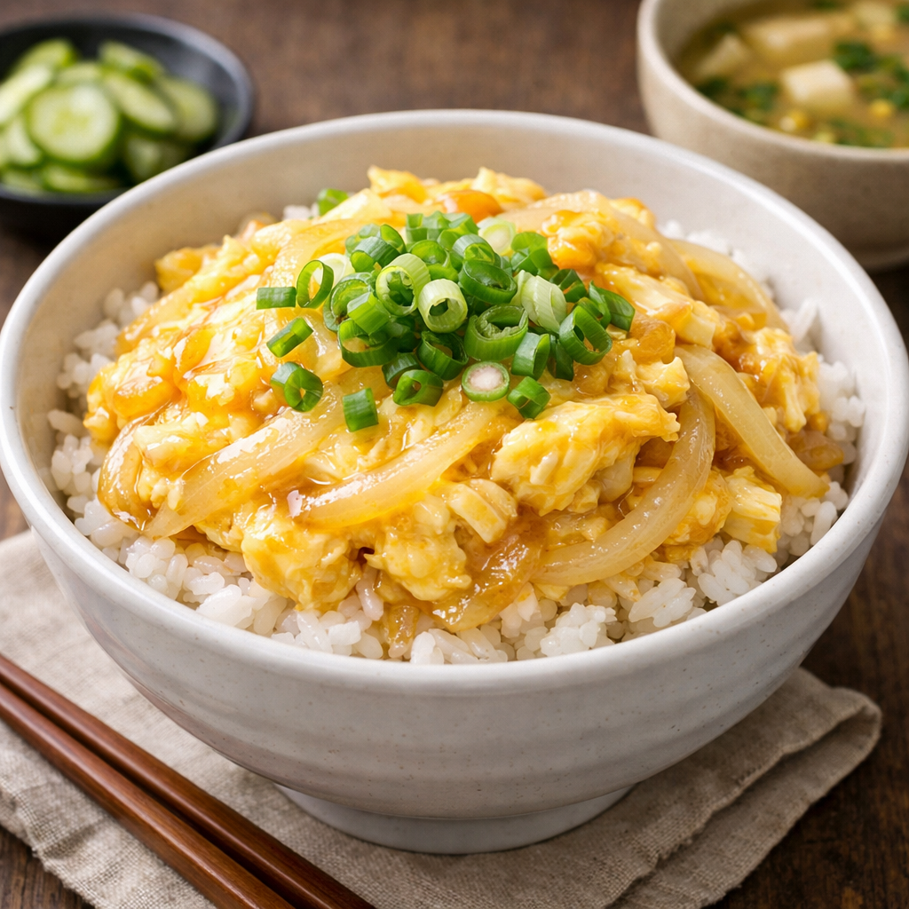

> 💑 **신혼부부 초간단 레시피** — *"우리 둘이 해먹는 가성비 집밥"* 시리즈 ②

# 🥚 계란덮밥

> ⏱️ 조리시간: 8분 | 🍽️ 2인분 | 난이도: ⭐ 쉬움
>
> 🏷️ *장보기 귀찮은 날, 달걀만으로 뚝딱! 신혼 가계부에 가장 착한 메뉴*

---

## 📝 재료 (2인분)

| | 재료 | 양 |
|---|------|-----|
| 🍚 | 밥 | 2공기 (400g) |
| 🥚 | 달걀 | 4개 |
| 🧅 | 양파 | 1/2개 |
| 🧅 | 대파 | 1/2대 |
| 🫘 | 간장 | 2큰술 |
| 🍬 | 설탕 | 1작은술 |
| 💧 | 물 | 6큰술 (약 90ml) |
| 🫒 | 식용유 | 1큰술 |

---

## ⏱️ 타임라인

| 시간 | 단계 | 할 일 |
|------|------|-------|
| 0:00 → 1:00 | 🔪 준비 1 | 양파 얇게 채 썰기 |
| 1:00 → 1:30 | 🥚 준비 2 | 볼에 달걀 4개 풀어 섞기 |
| 1:30 → 2:30 | 🔥 볶기 | 팬에 식용유 → 중불에서 양파 1분 |
| 2:30 → 3:00 | 🍲 소스 | 물 + 간장 + 설탕 넣고 30초 끓이기 |
| 3:00 → 3:30 | 🥚 달걀 | 풀어둔 달걀을 원 그리며 붓기 |
| 3:30 → 5:30 | ⏳ 기다리기 | 약불 → 젓지 말고 1~2분 대기 |
| 5:30 → 8:00 | ✨ 마무리 | 밥 위에 소스째 올리기 → 대파 → 완성! |

---

## 👨‍🍳 만드는 법

> 🔪 **STEP 1** — 양파 썰기
> 양파를 얇게 채 썰기 (없으면 건너뛰기 OK!)
>
> ⬇️
>
> 🥚 **STEP 2** — 달걀 준비
> 볼에 달걀 4개 → 젓가락으로 풀어 섞기
>
> ⬇️
>
> 🔥 **STEP 3** — 양파 볶기
> 팬에 식용유 → 중불 → 양파 넣고 1분 볶기
>
> ⬇️
>
> 🍲 **STEP 4** — 소스 만들기
> 물 6큰술 + 간장 2큰술 + 설탕 1작은술 → 30초 끓이기
>
> ⬇️
>
> 🥚 **STEP 5** — 달걀 붓기
> 풀어둔 달걀을 원을 그리며 천천히~ 부어주기
>
> ⬇️
>
> ⏳ **STEP 6** — 반숙 만들기
> 약불로 줄이기 → 젓지 말고 1~2분 기다리기
> 🎯 반숙이 맛있는 계란덮밥의 핵심!
>
> ⬇️
>
> ✨ **STEP 7** — 완성!
> 🍚 밥 담기 → 🥚 달걀 소스째 올리기 → 🧅 대파 송송
> 🎉 **완성!!**

---

## 💡 꿀팁

| | 팁 |
|---|-----|
| 🥚 | **반숙이 핵심** → 달걀을 너무 오래 익히지 마세요! 반숙에서 밥 위에 올리기 |
| 🍳 | **설거지 최소화** → 팬 1개 + 젓가락 1쌍으로 끝! 달걀 푼 젓가락으로 밥도 먹기 |
| 🔄 | **소스 변형** → 간장 대신 돈까스 소스·굴소스로 색다른 맛 |
| 🥕 | **영양 추가** → 냉동 완두콩·당근 넣으면 색감도 예쁘고 영양 UP |

---

## 🛒 신혼부부 가성비 장보기 추천

> 💑 마트 갈 때 이렇게 사면 한 주 내내 돌려먹을 수 있어요!

| | 재료 | ⭐ 추천 제품 | 예상 가격 | 💬 가성비 포인트 |
|---|------|-------------|-----------|-----------------|
| 🥚 | 달걀 | 30구 대란 1판 | 6,500~7,500원 | 개당 약 220원 → 10구(3,500원)보다 **40% 저렴** |
| ↪️ | | | | 1회 4개 사용 → **7~8회분(14~16인분)** |
| 🧅 | 양파 | 양파 망 1.5kg (7~8개) | 3,000~4,000원 | 낱개(700원)보다 **50% 저렴** → 상온 보관 OK |
| ↪️ | | | | 1회 1/2개 사용 → **14~16회분** |
| 🧅 | 대파 | 대파 1단 (3~4대) | 1,500~2,000원 | 1회에 1/2대 → **6~8회분** |
| 🧂 | 간장 | 간장 500ml | 2,500원 | 1회 2큰술(30ml) → **약 16회분** |
| 🧂 | 설탕 | 설탕 1kg | 2,000원 | 1회 1작은술 → 사실상 **무한** |

> 💡 재료가 달걀·양파·대파·기본양념뿐이라 **가장 저렴한 메뉴!** 양파 망 + 달걀 30구만 사면 한동안 걱정 없어요
