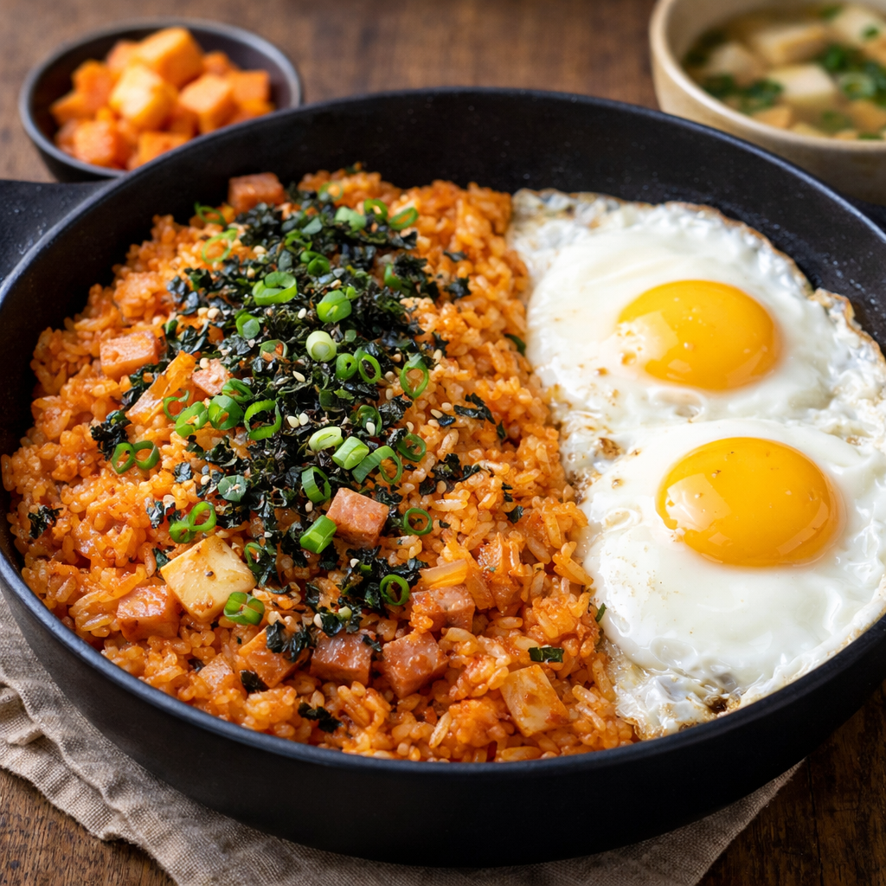

> 💑 **신혼부부 초간단 레시피** — *"우리 둘이 해먹는 가성비 집밥"* 시리즈 ①

# 🍳 김치볶음밥

> ⏱️ 조리시간: 10분 | 🍽️ 2인분 | 난이도: ⭐ 쉬움
>
> 🏷️ *퇴근 후 냉장고에 김치밖에 없을 때, 둘이 후다닥 볶아먹는 신혼 필수 메뉴!*

---

## 📝 재료 (2인분)

| | 재료 | 양 |
|---|------|-----|
| 🍚 | 밥 | 2공기 (400g) |
| 🥬 | 김치 | 200g (잘 익은 것) |
| 🥩 | 스팸 | 1/2캔 (100g) |
| 🥚 | 달걀 | 2개 |
| 🧅 | 대파 | 1/2대 |
| 🌿 | 김 가루 | 2큰술 |
| 🫘 | 간장 | 2작은술 |
| 💧 | 참기름 | 1큰술 |
| 🫒 | 식용유 | 2큰술 |

---

## ⏱️ 타임라인

| 시간 | 단계 | 할 일 |
|------|------|-------|
| 0:00 → 1:00 | ✂️ 준비 | 김치를 가위로 먹기 좋게 자르기 |
| 1:00 → 3:00 | 🔥 볶기 1 | 팬에 식용유 → 중불에서 김치 볶기 |
| 3:00 → 3:30 | 🥩 볶기 2 | 스팸 투입 → 30초 볶기 |
| 3:30 → 5:30 | 🍚 볶기 3 | 밥 투입 → 김치와 섞으며 2분 볶기 |
| 5:30 → 6:00 | 🧂 간 맞추기 | 간장 넣고 한 번 더 섞기 |
| 6:00 → 8:30 | 🍳 달걀 | 팬 한쪽으로 밀고 달걀 프라이 2개 |
| 8:30 → 10:00 | ✨ 마무리 | 참기름 + 김 가루 + 대파 → 완성! |

---

## 👨‍🍳 만드는 법

> ✂️ **STEP 1** — 김치 자르기
> 김치를 가위로 먹기 좋게 싹둑싹둑! 도마 없이 그릇 위에서 바로 자르면 편해요
>
> ⬇️
>
> 🔥 **STEP 2** — 김치 볶기
> 팬에 식용유 두르고 → 중불 → 김치 넣고 1~2분 볶기
>
> ⬇️
>
> 🥩 **STEP 3** — 스팸 투입
> 스팸 깍둑썰기 해서 넣고 → 30초 더 볶기
>
> ⬇️
>
> 🍚 **STEP 4** — 밥 볶기
> 밥 투입 → 김치와 잘 섞으며 2분간 볶기
> 🎯 밥알이 빨갛게 물들면 성공!
>
> ⬇️
>
> 🧂 **STEP 5** — 간 맞추기
> 간장 2작은술 넣고 → 한 번 더 섞어주기
>
> ⬇️
>
> 🍳 **STEP 6** — 달걀 프라이
> 팬 한쪽으로 볶음밥 밀기 → 빈 공간에 달걀 프라이 2개
>
> ⬇️
>
> ✨ **STEP 7** — 완성!
> 🔥 불 끄기 → 💧 참기름 뿌리기 → 🌿 김 가루 & 대파 올리기
> 🎉 **완성!!**

---

## 💡 꿀팁

| | 팁 |
|---|-----|
| 🍚 | **찬밥 활용** → 전날 남은 차가운 밥이 수분이 적어 볶음밥에 최고! |
| 🍳 | **설거지 최소화** → 팬 하나로 볶음밥 + 프라이 동시에! |
| 🔄 | **재료 대체** → 스팸 대신 두부·소시지·어묵 뭐든 OK |
| 🥬 | **맛 깊게** → 김치 국물 조금 넣으면 간도 맞고 감칠맛 UP |

---

## 🛒 신혼부부 가성비 장보기 추천

> 💑 마트 갈 때 이렇게 사면 한 주 내내 돌려먹을 수 있어요!

| | 재료 | ⭐ 추천 제품 | 예상 가격 | 💬 가성비 포인트 |
|---|------|-------------|-----------|-----------------|
| 🥬 | 김치 | 종가집 맛김치 900g | 7,000~8,000원 | 1회 200g 사용 → **4~5회분(8~10인분)** |
| ↪️ | | 🔄 마트 소포장 300g | 3,500원 | 바로 쓸 양만 → 냉장고 부담 없음 |
| 🥩 | 스팸 | 스팸 클래식 200g × 2입 묶음 | 7,000~8,000원 | 캔당 3,500원 → 낱개(4,500원)보다 **22% 저렴** |
| ↪️ | | 🔄 리챔 or PB 런천미트 200g | 2,500~3,000원 | 스팸 맛 80% + 가격 **40% 저렴** |
| 🥚 | 달걀 | 30구 대란 1판 | 6,500~7,500원 | 개당 약 220원 → 10구(3,500원)보다 **40% 저렴** |
| 🧅 | 대파 | 대파 1단 (3~4대) | 1,500~2,000원 | 1회에 1/2대 → **6~8회분** |
| 🌿 | 김 가루 | 김 가루 70g 지퍼백 | 2,500~3,000원 | 1회 2큰술(6g) → **약 11회분** |
| 🧂 | 간장 | 간장 500ml | 2,500원 | 수십 회 사용 가능 |
| 💧 | 참기름 | 참기름 160ml | 4,000~5,000원 | 1회 1큰술(15ml) → **약 10회분** |
