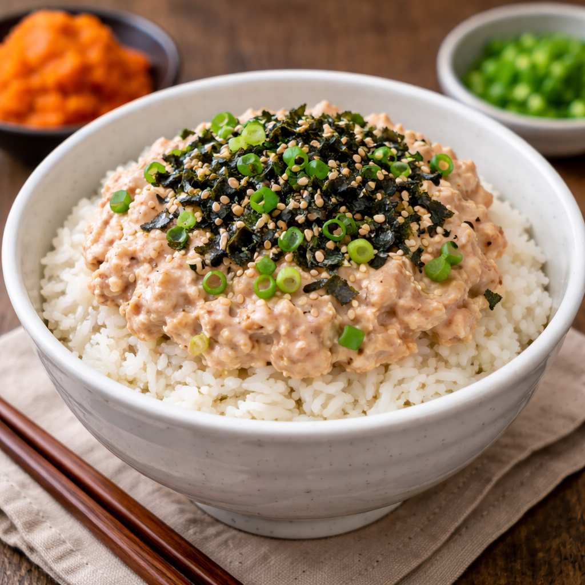

> 💑 **신혼부부 초간단 레시피** — *"우리 둘이 해먹는 가성비 집밥"* 시리즈 ③

# 🐟 참치마요덮밥

> ⏱️ 조리시간: 5분 | 🍽️ 2인분 | 난이도: ⭐ 쉬움
>
> 🏷️ *불도 안 쓰고 5분 컷! 요리 왕초보 신혼부부의 구세주*

---

## 📝 재료 (2인분)

| | 재료 | 양 |
|---|------|-----|
| 🍚 | 밥 | 2공기 (400g) |
| 🐟 | 참치캔 | 1캔 (150g) |
| 🥛 | 마요네즈 | 3큰술 |
| 🧅 | 대파 or 쪽파 | 1/2대 |
| 🌿 | 김 가루 | 2큰술 |
| 🫘 | 간장 | 1큰술 |
| 🍬 | 설탕 | 1작은술 |
| 💧 | 참기름 | 1작은술 |

---

## ⏱️ 타임라인

| 시간 | 단계 | 할 일 |
|------|------|-------|
| 0:00 → 0:30 | 🥫 준비 1 | 참치캔 따고 기름(물) 짜기 |
| 0:30 → 2:00 | 🥣 소스 | 참치 + 마요 + 양념 섞기 |
| 2:00 → 3:00 | 🍚 담기 | 따뜻한 밥 그릇에 담기 |
| 3:00 → 4:00 | 🐟 올리기 | 참치마요 소스를 밥 위에 |
| 4:00 → 5:00 | ✨ 마무리 | 대파 + 김 가루 뿌려 완성! |

---

## 👨‍🍳 만드는 법

> 🥫 **STEP 1** — 참치캔 준비
> 참치캔 따기 → 캔 뚜껑으로 꾹 눌러 기름(물) 짜기
>
> ⬇️
>
> 🥣 **STEP 2** — 소스 만들기
> 볼에 참치 + 마요네즈 3큰술 + 간장 1큰술 + 설탕 1작은술 + 참기름 1작은술
> → 잘 섞어주기
>
> ⬇️
>
> 🍚 **STEP 3** — 밥 담기
> 따뜻한 밥을 그릇 2개에 나눠 담기
>
> ⬇️
>
> 🐟 **STEP 4** — 소스 올리기
> 참치마요 소스를 밥 위에 반씩 올리기
>
> ⬇️
>
> ✨ **STEP 5** — 완성!
> 🧅 대파(쪽파) 송송 + 🌿 김 가루 뿌리기
> 🔥 불 사용 ZERO → 🎉 **완성!!**

---

## 💡 꿀팁

| | 팁 |
|---|-----|
| 🚫🔥 | **불 필요 없음** → 밥만 있으면 5분 컷! 전자레인지 즉석밥이면 더 빠름 |
| 🐟 | **기름 제거 필수** → 참치 기름 완전히 빼야 느끼하지 않아요 |
| 🥛 | **마요 조절** → 많이 넣으면 부드럽고 크리미, 줄이면 담백 |
| 🍽️ | **설거지 최소화** → 밥그릇에 소스 직접 섞어 먹으면 그릇 1개로 끝! |
| 🥒 | **토핑 추가** → 오이·아보카도 슬라이스 곁들이면 풍성한 한 끼 |

---

## 🛒 신혼부부 가성비 장보기 추천

> 💑 마트 갈 때 이렇게 사면 한 주 내내 돌려먹을 수 있어요!

| | 재료 | ⭐ 추천 제품 | 예상 가격 | 💬 가성비 포인트 |
|---|------|-------------|-----------|-----------------|
| 🐟 | 참치캔 | 동원 라이트스탠다드 4캔 묶음 | 7,500~8,500원 | 캔당 약 2,000원 → 낱개(2,500원)보다 **20% 저렴** |
| ↪️ | | 🔄 PB 참치 (노브랜드·피코크) 4캔 | 5,500~6,500원 | 캔당 약 1,500원 → **가성비 최강** |
| ↪️ | | | | 1회 1캔 사용 → **4회분(8인분)** |
| 🥛 | 마요네즈 | 오뚜기 마요네즈 500g | 3,500~4,000원 | 1큰술 ≈ 15g → 약 33큰술 = **11회분** |
| ↪️ | | ❌ 소용량 80g은 비추! | 1,500원 | 5회분밖에 안 되고 g당 가격 **3배** |
| 🧅 | 대파 | 대파 1단 (3~4대) | 1,500~2,000원 | 1회에 1/2대 → **6~8회분** |
| 🌿 | 김 가루 | 김 가루 70g 지퍼백 | 2,500~3,000원 | 1회 2큰술(6g) → **약 11회분** |
| 💧 | 참기름 | 참기름 160ml | 4,000~5,000원 | 1회 1작은술(5ml) → **약 32회분** |

> 💡 마요네즈는 **절대 소용량(80g) 사지 마세요!** 500g이 g당 가격 1/3이고 2인 가구면 유통기한 안에 충분히 소진돼요
